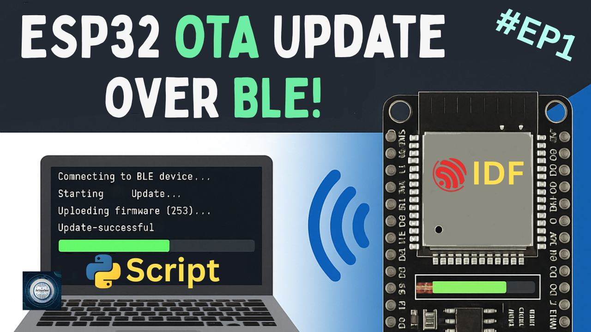
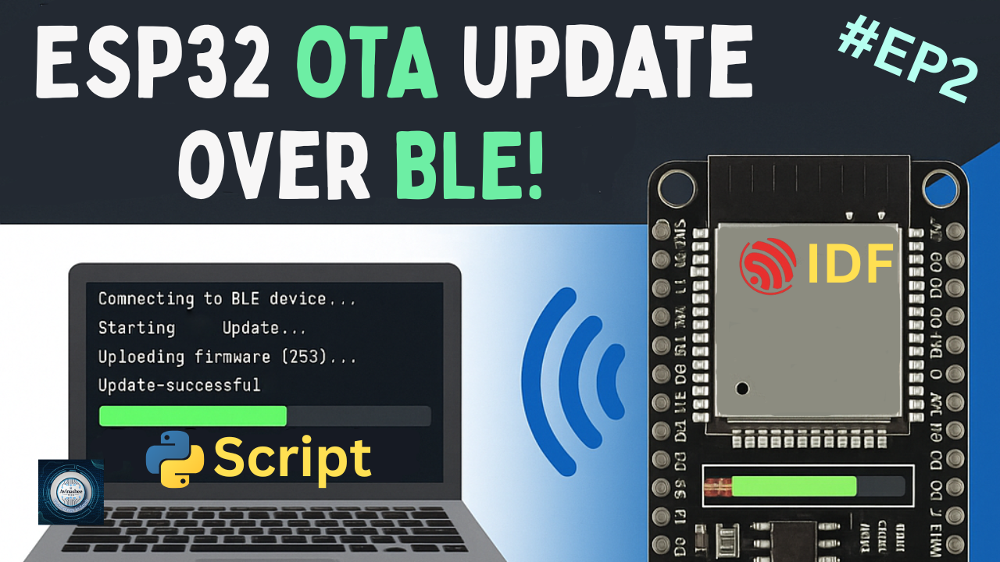
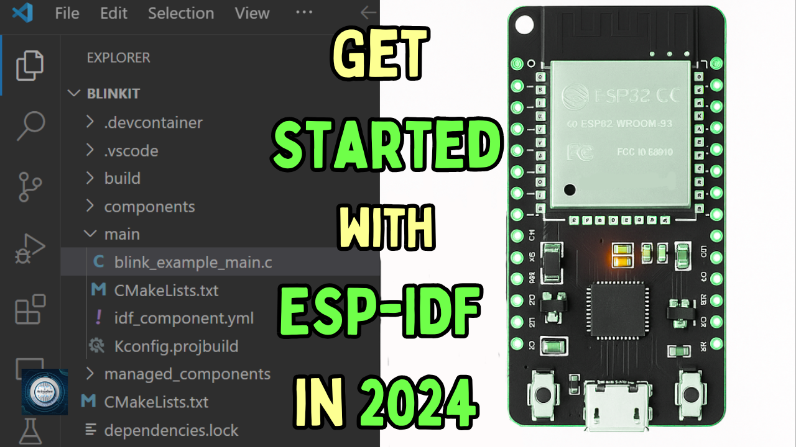

<h1 align="center">
  <a href="https://www.youtube.com/@eccentric_engineer">
	
  </a>  
</h1>

<h3 align="center">
	ESP32 Bluetooth OTA firmware update using ESP-IDF
</h3>


  
## 📝 Overview

This project is a Bluetooth Low Energy application to cover OTA firmware update over BLE using bluedroid stack of ESP32.  
ESP32 acts as a peripheral and gatt server while our pc acts as central device and gatt client.  
A python script is to be run on the client or PC side(use python 3.8 or above) device after activating bluetooth connectivity  
and selecting binary file path in the script.  
A custom partition table for OTA update is used based on default options available.  
Build and flash the given code using ESP-IDF platform.  

You can find a reference wherein OTA update using NimBLE stack on ESP32 is discussed. 
Find it here - https://michaelangerer.dev/esp32/ble/ota/2021/06/01/esp32-ota-part-1.html

Platform used for firmware development is ESP-IDF on VSCode.  
Learn more 👇👇  
  
[](https://youtu.be/TVyrbbPs0R8)  
[](https://youtu.be/faxTXwhB_ho)

## ✔️ Requirements

### 📦 Hardware
- ESP32 Devkit V1 (main controller  board)
- USB Micro Cable 

### 📂 Software
- VSCode (https://code.visualstudio.com/)  
- ESP-IDF (https://docs.espressif.com/projects/vscode-esp-idf-extension/en/latest/installation.html)

## 🛠️ Installation and usage

```sh
git clone https://github.com/AvinasheeTech/ESP32-IDF-BLE-OTA.git
Open project in VSCode
Go to ESP-IDF explorer icon in the left side panel -> Select Open ESP-IDF Terminal
Enter the command 'idf.py build' to build the firmware.
Next connect ESP32 device to PC and confirm the COM port available.
Run the command 'idf.py -p PORT flash' where PORT is COMx with x being a number to flash the firmware.
Once upload is complete, run command 'idf.py -p PORT monitor' to serially monitor firmware.
Turn on Bluetooth on PC and open main.py script from BLE_OTA-script directory in VSCode.
At the end of the script, in code asyncio.run(__ota_main__("PATH.bin")). Replace PATH.bin with the
binary file path of the firmware to be updated via OTA over BLE.
Open up Powershell. Make sure you have installed bleak and asyncio module using pip.
Execute command 'python main.py'. The script finds your ESP32 device and starts uploading the
selected binary file.
Enjoy...🍹
```
To learn more about how to upload code to ESP32 using VSCode, click link below 👇👇  

[](https://youtu.be/aKiBNeOgbLA)


## ⭐️ Show Your Support

If you find this helpful or interesting, please consider giving us a star on GitHub. Your support helps promote the project and lets others know that it's worth checking out. 

Thank you for your support! 🌟

[](https://github.com/AvinasheeTech/ESP32-IDF-BLE-OTA/stargazers)
